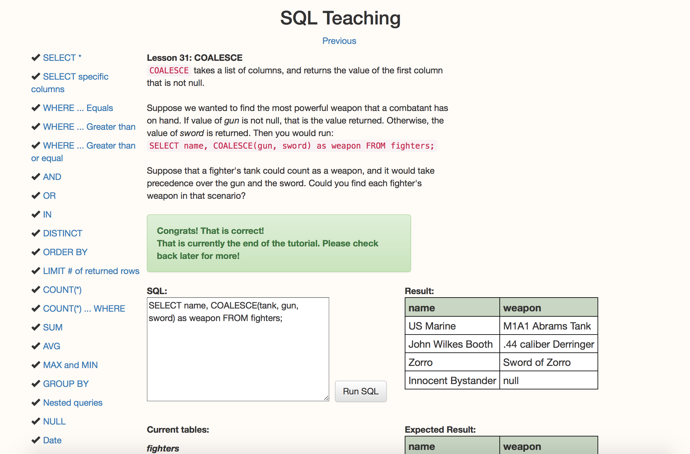

<!-- #   SQL_practice
--------------------------------------------------------------------------------
Explorer Mode
------------------------------
 1) How many users are there?
    select count(*) from users;    Result: 50
------------------------------
 2) What are the 5 most expensive items?
    select * from items order by price desc limit 5;

  id|title|category|description|price
  25|Small Cotton Gloves|Automotive, Shoes & Beauty|Multi-layered modular service-desk|9984
  83|Small Wooden Computer|Health|Re-engineered fault-tolerant adapter|9859
 100|Awesome Granite Pants|Toys & Books|Upgradable 24/7 access|9790
  40|Sleek Wooden Hat|Music & Baby|Quality-focused heuristic info-mediaries|9390
  60|Ergonomic Steel Car|Books & Outdoors|Enterprise-wide secondary firmware|9341
------------------------------
 3) What's the cheapest book? (Does that change for "category is exactly 'book'" versus "category contains
 'book'"?)
     a) select *
        from items
        where category = 'book'
        order by price
        limit 1;

        Returns nothing because in the table there are "Books", no 'book'.  To get something the
        where clause would need to say "Books"

        id|title|category|description|price
        76|Ergonomic Granite Chair|Books|De-engineered bi-directional portal|1496

     b) select *
        from items
        where category like '%book%'
        order by price;

        SQLite is case insensitive by default so this returns anything with Books.  

        id|title|category|description|price
        76|Ergonomic Granite Chair|Books|De-engineered bi-directional portal|1496
        95|Small Cotton Hat|Beauty & Books|Reduced regional instruction set|1727
        97|Incredible Granite Computer|Books, Toys & Tools|De-engineered national policy|2377
        98|Practical Plastic Hat|Books|Implemented non-volatile model|3056
        77|Fantastic Plastic Gloves|Beauty, Movies & Books|Robust bandwidth-monitored local area network|6584
        12|Fantastic Rubber Shirt|Toys & Books|Ergonomic impactful emulation|6720
        21|Fantastic Rubber Shoes|Books|Reverse-engineered modular hierarchy|8904
        4|Fantastic Steel Chair|Books|Advanced attitude-oriented encryption|9246
        60|Ergonomic Steel Car|Books & Outdoors|Enterprise-wide secondary firmware|9341
        100|Awesome Granite Pants|Toys & Books|Upgradable 24/7 access|9790

 4) Who lives at "6439 Zetta Hills, Willmouth, WY"? Do they have another address?
             Corrine Little and she has one other address.

    select *
        from users join addresses
        where users.id = user_id
        and street = "6439 Zetta Hills" and city = "Willmouth" and state = "WY";

     id|first_name|last_name|email|id|user_id|street|city|state|zip
     40|Corrine|Little|rubie_kovacek@grimes.net|43|40|6439 Zetta Hills|Willmouth|WY|15029

     select *
         from users join addresses
         where users.id = user_id
         and users.id = 40;

         id|first_name|last_name|email|id|user_id|street|city|state|zip
         40|Corrine|Little|rubie_kovacek@grimes.net|43|40|6439 Zetta Hills|Willmouth|WY|15029
         40|Corrine|Little|rubie_kovacek@grimes.net|44|40|54369 Wolff Forges|Lake Bryon|CA|31587

------------------------------
 5) Correct Virginie Mitchell's address to "New York, NY, 10108".

 She has two addresses -

 select addresses.id, *
     from users join addresses
     where users.id = user_id
     and first_name = "Virginie"
     and last_name = "Mitchell"
     and state = "NY"
      ;

      id|id|first_name|last_name|email|id|user_id|street|city|state|zip
      41|39|Virginie|Mitchell|daisy.crist@altenwerthmonahan.biz|41|39|12263 Jake Crossing|Roxanehaven|NY|34705
      42|39|Virginie|Mitchell|daisy.crist@altenwerthmonahan.biz|42|39|83221 Mafalda Canyon|Bahringerland|WY|24028

  update addresses
  set city = "New York", zip = 10108
  where id =     
         ( select addresses.id
             from users join addresses
             where users.id = user_id
             and first_name = "Virginie"
             and last_name = "Mitchell"
             and state = "NY" )
              ;

   Ran above select leaving off the state:
   41|39|Virginie|Mitchell|daisy.crist@altenwerthmonahan.biz|41|39|12263 Jake Crossing|New York|NY|10108
   42|39|Virginie|Mitchell|daisy.crist@altenwerthmonahan.biz|42|39|83221 Mafalda Canyon|Bahringerland|WY|24028

------------------------------
 6) How much would it cost to buy one of each tool?
   select sum(price) from items where category like '%tools%';
          sum(price)
          46477

          sqlite> select * from items where category like '%tools%' order by title;						
          id|title|category|description|price						
          87|Awesome Plastic Shirt|Tools|Balanced multimedia paradigm|839						839
          59|Fantastic Granite Computer|Tools, Jewelery & Industrial|Integrated context-sensitive matrices|7606						7606
          66|Gorgeous Granite Car|Tools & Computers|Enhanced encompassing parallelism|2768						2768
          64|Gorgeous Plastic Computer|Tools, Garden & Games|Upgradable multi-state policy|1913						1913
          20|Gorgeous Plastic Shoes|Industrial & Tools|Synergized stable orchestration|2851						2851
          50|Gorgeous Rubber Chair|Tools, Garden & Movies|Triple-buffered even-keeled capability|3335						3335
          97|Incredible Granite Computer|Books, Toys & Tools|De-engineered national policy|2377						2377
          49|Incredible Granite Gloves|Garden, Toys & Tools|Ameliorated bottom-line function|798						798
          80|Incredible Plastic Gloves|Tools|Operative mission-critical emulation|5437						5437
          67|Practical Concrete Table|Sports & Tools|Universal object-oriented functionalities|3160						3160
          32|Practical Rubber Shirt|Tools|De-engineered multimedia info-mediaries|1107						1107
          84|Rustic Cotton Chair|Games, Sports & Tools|Diverse exuding alliance|5210						5210
          99|Rustic Rubber Hat|Tools & Kids|Open-source object-oriented hierarchy|985						985
          51|Rustic Steel Shirt|Tools, Clothing & Toys|Proactive incremental attitude|615						615
          13|Small Plastic Pants|Beauty, Shoes & Tools|Optimized actuating structure|7476						7476
          					Total	46477
------------------------------
 7) How many total items did we sell?
     select sum(quantity) from orders;
     sum(quantity)
         2125

------------------------------
 8) How much was spent on books?

 select sum(price*quantity)
 from orders join items
 where item_id = items.id
 and category = "Books";

      sum(price*quantity)
           420566

 select sum(price*quantity)
 from orders join items
 where item_id = items.id
 and category like "%books%";

     sum(price*quantity)
         1081352
------------------------------
 9) Simulate buying an item by inserting a User for yourself and an Order for that User.

 INSERT
    INTO users(first_name, last_name, email)
    VALUES('Nancy', 'Ingels', 'ingelsna@gmail.com');

    sqlite> select * from users where first_name = 'Nancy';
      id|first_name|last_name|email
      51|Nancy|Ingels|ingelsna@gmail.com

 INSERT
   INTO orders (user_id, item_id, quantity, created_at)    
   VALUES (51, 3, 50, "2017-02-14 15:42:00.000000");

   Also inserted another order quantity of 100.  

   select sum(quantity), price, sum(quantity * price)
   from users join orders join items
   where user_id = users.id
    and item_id = items.id
   and user_id = 51
   group by price;

        sum(quantity)|price|sum(quantity * price)
                150|7815|1172250

--------------------------------------------------------------------------------

Adventure Mode

------------------------------
 1) What item was ordered most often? Grossed the most money?
   a) select item_id, title, category, sum(quantity)
      from orders
      join items where item_id = items.id
      group by item_id, title, category
      order by sum(quantity) desc
      limit 1;

         item_id|title|category|sum(quantity*)
      3|Intelligent Concrete Computer|Computers, Sports & Grocery|160

   b) select item_id, title, category, sum(quantity*price)
         from orders
         join items where item_id = items.id
         group by item_id, title, category
         order by sum(quantity*price) desc
         limit 1;

         item_id|title|category|sum(quantity*price)
         3|Intelligent Concrete Computer|Computers, Sports & Grocery|1250400

------------------------------
 2) What user spent the most?
    Me, the record I inserted.

 select users.id, first_name, last_name, sum(quantity*price)
       from users
       join orders on users.id = user_id
       join items on item_id = items.id
       group by users.id, first_name, last_name
       order by sum(quantity*price) desc
       limit 2;

       id|first_name|last_name|sum(quantity*price)
       51|Nancy|Ingels|1172250
       19|Hassan|Runte|639386

------------------------------
 3) What were the top 3 highest grossing categories?

 select category, sum(quantity*price)
       from orders
       join items on item_id = items.id
       group by category
       order by sum(quantity*price) desc
       limit 3;

       category                     | sum(quantity*price)
       Computers, Sports & Grocery  | 1250400
       Music, Sports & Clothing     | 525240
       Beauty, Toys & Sports        | 449496

--------------------------------------------------------------------------------

 -->

